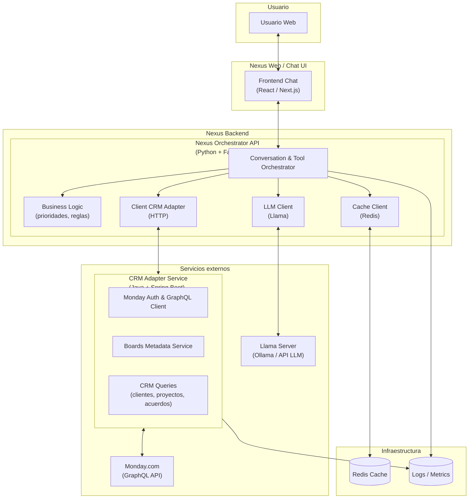

# Nexus Assistant – Arquitectura v0.1 (Demo CRM Monday)

## 1. Objetivo del sistema

**Nexus Assistant (v0.1)** es un asistente inteligente que integra:

- Un **LLM (Llama)** para entender instrucciones del usuario.
- Un **Orquestador** que ejecuta acciones mediante tools.
- Un **CRM Adapter (Java)** que consume Monday.com vía GraphQL.
- **Lógica de negocio** para calcular prioridades.
- Un **frontend tipo chat** para interacción humana.

El sistema permite a un usuario no técnico consultar datos del CRM y recibir respuestas inteligentes como:

- “¿A qué cliente debo darle prioridad?”
- “¿Qué proyecto está más atrasado?”
- “Dame acuerdos sin progreso.”

---

## 2. Vista de Arquitectura (Contenedores – Nivel C4)

Diagrama actualizado y corregido:


---

## 3. Componentes principales
### 3.1. Frontend – Nexus Chat UI

**Tecnología sugerida: React / Next.js**

Funciones:
- UI estilo chat.
- Envía peticiones al Orchestrator via HTTP o WebSockets.
- Muestra respuestas procesadas, tablas o datos de CRM.

### 3.2. Nexus Orchestrator API (Python + FastAPI)

**El corazón del sistema**, encargado de:
- Recibir mensajes del usuario.
- Preguntar al LLM qué herramienta usar.
- Ejecutar herramientas del backend.
- Hacer lógica de negocio.
- Redactar la respuesta final.

#### 3.2.1. Conversation & Tool Orchestrator (OC)

Responsable del flujo:

1. Recibe petición del usuario.
2. Llama a Llama (planner) para decidir qué tool ejecutar:
    - list_clients
    - list_projects
    - list_agreements_without_progress
3. Ejecuta la tool.
4. Procesa resultados.
5. Llama a Llama (answer) para producir la respuesta final.
6. Retorna el mensaje al frontend.

#### 3.2.2. Business Logic (BL)

Encargada de calcular:

- Prioridad de clientes
→ según deal_value, días sin actualización, estatus.
- Prioridad de proyectos
→ según % de avance, fecha estimada de entrega, monto.
- Acuerdos sin progreso
→ días sin cambios.

Trabaja sobre los JSON que entrega el CRM Adapter.

#### 3.2.3. Client CRM Adapter (CA)

Cliente HTTP simple hacia el servicio Java.

Endpoints ejemplo:

- `GET /crm/boards-map`
- `POST /crm/clients/list`
- `POST /crm/projects/list`
- `POST /crm/agreements/without-progress`

Se encarga de:

- No exponer tokens de Monday en Python.
- Transformar requests del Orchestrator en GraphQL en Java.
- Devolver JSON limpio y uniforme.

#### 3.2.4. Cache Client (CC)

Encapsula Redis.

Cachea: 
- `boards_map`
- posibles resultados intermedios

Beneficios:
- Acelera el acceso a Monday
- Reduce llamadas innecesarias

#### 3.2.5. LLM Client (LC)

Cliente para el servidor Llama u Ollama.

Debe manejar:
- `chat_planner()` → LLM decide tool + argumentos
- `chat_answer()` → LLM redacta la respuesta final

Carga:

- El system prompt de Nexus Assistant.
- El JSON schema de las tools.

### 3.3. CRM Adapter Service (Java + Spring Boot)
#### 3.3.1. Monday Auth & GraphQL Client (MA)

Maneja:

- Tokens
- URLs
- Headers
- Llamadas GraphQL

API interna:

```java
MondayGraphQLClient.execute(query, variables)
```

#### 3.3.2. Boards Metadata Service (BM)

Usa el query Monday:

```graphql
query ($wsId: ID!) {
  boards(state: all, limit: 200, workspace_ids: [$wsId]) {
    id
    name
    board_kind
    state
    description
    url
    access_level
    items_count
    updated_at
    workspace_id
    workspace { id name }
  }
}
```

Endpoint sugerido:

- `GET /crm/boards-map`

Clasifica boards en:

- clients
- projects
- agreements
- unknown

Devuelve JSON estándar.

#### 3.3.3. CRM Queries (CQ)

Endpoints:

- `POST /crm/clients/list`
- `POST /crm/projects/list`
- `POST /crm/agreements/without-progress`

Cada endpoint:

- Identifica board correcto según role.
- Construye y ejecuta query con Monday.
- Devuelve JSON limpio:
    - items
    - meta
    - error_code (si aplica)

### 3.4. Llama Server (LL)

Puede ser:
- Ollama local (llama3:8b, llama3.1:8b)
- Un proveedor compatible con tools

Responsabilidades:
- Entender intención del usuario
- Seleccionar herramienta adecuada
- Redactar respuesta final con los datos

### 3.5. Redis Cache (R)

Funciones:
- Cachear `boards_map`
- Reducir el número de llamadas a Monday
- Evitar recomputar prioridades repetidas

---

## 4. Flujo típico:
**“Muéstrame mis clientes y dime a quién priorizar”**
🧩 Paso 1 – Usuario → Frontend
> "Muéstrame mis clientes y dime cuál es prioridad"

🧩 Paso 2 – Frontend → Orchestrator
```json
{
  "user_id": "XYZ",
  "message": "Muéstrame mis clientes y dime cuál es prioridad"
}
```

🧩 Paso 3 – Orchestrator → Llama (Planner)

Llama decide:

```json
{
  "tool_call": {
    "name": "list_clients",
    "arguments": {
      "status": null,
      "limit": 20
    }
  }
}
```

🧩 Paso 4 – Orchestrator → Tool (Python) → CRM Adapter → Monday

- Se obtiene boards_map
- Se ubica el board de clients
- Se ejecuta query a Monday
- Se obtienen clientes

🧩 Paso 5 – Business Logic

- Calcula prioridad:
    ```python
    score = f(deal_value, días_sin_update, estatus)
    ```
- Genera lista ordenada
- Selecciona `top_client`

🧩 Paso 6 – Orchestrator → Llama (Answer)

Llama genera respuesta final:

> “El cliente con mayor prioridad es XYZ, tiene 50k de valor y lleva 20 días sin actualización. Te recomiendo contactarlo hoy mismo.”

🧩 Paso 7 – Orchestrator → Frontend → Usuario
5. Contrato interno estándar para tools (Python ← Java)

Éxito:

```json
{
  "ok": true,
  "error_code": null,
  "message": null,
  "data": {
    "items": [],
    "meta": {
      "board_id": "1829",
      "board_name": "Clientes CRM"
    }
  }
}
```

Error típico (no hay boards de clientes):

```json
{
  "ok": false,
  "error_code": "NO_CLIENT_BOARDS",
  "message": "No se encontraron boards que parezcan contener clientes.",
  "data": {
    "available_boards": []
  }
}
```

---

6. Roadmap técnico (primer sprint)
👉 Crear repos:

- `nexus-orchestrator` (Python + FastAPI)
- `crm-adapter` (Java + Spring Boot)

👉 En `crm-adapter`:

- `MondayGraphQLClient`
- `BoardsMetadataService`
- Endpoints:
    - `/crm/boards-map`
    - `/crm/clients/list`
    - `/crm/projects/list`
    - `/crm/agreements/without-progress`

👉 En `nexus-orchestrator`:

- `LLMClient`
- `CacheClient`
- Tools:
    - list_clients()
    - list_projects()
    - list_agreements_without_progress()

- `BusinessLogic`
- `POST /api/chat/answer`

👉 Configurar Llama:
- Levantar modelo con tools (`llama3.1:8b`)
- Cargar system prompt
- Cargar schemas

👉 Frontend:
- Chat mínimo utilizando el endpoint `/api/chat/answer`
